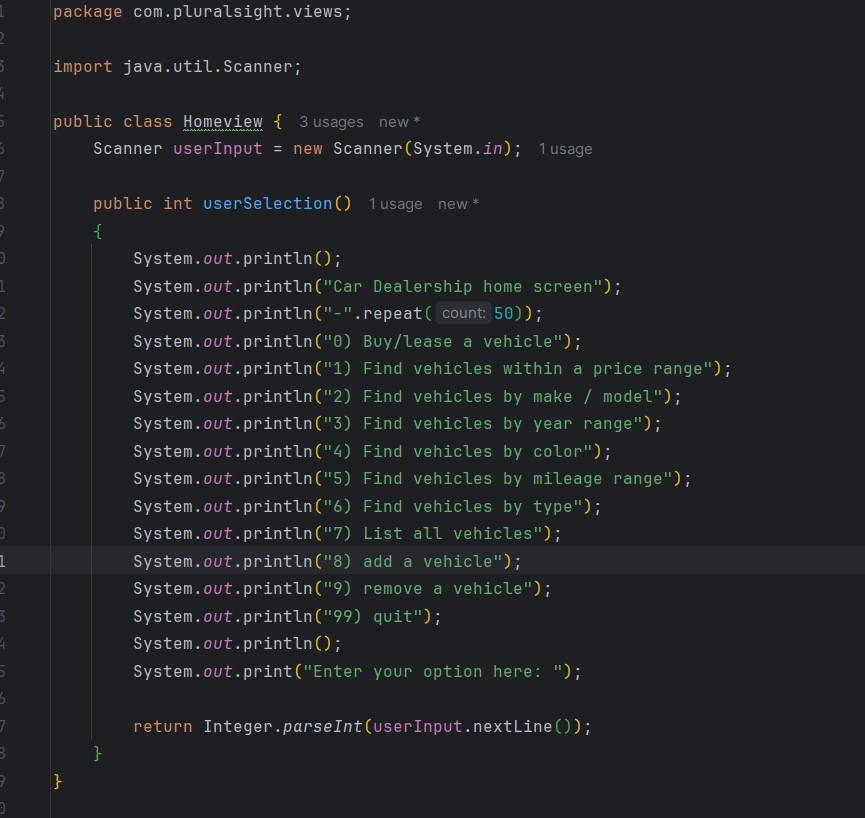
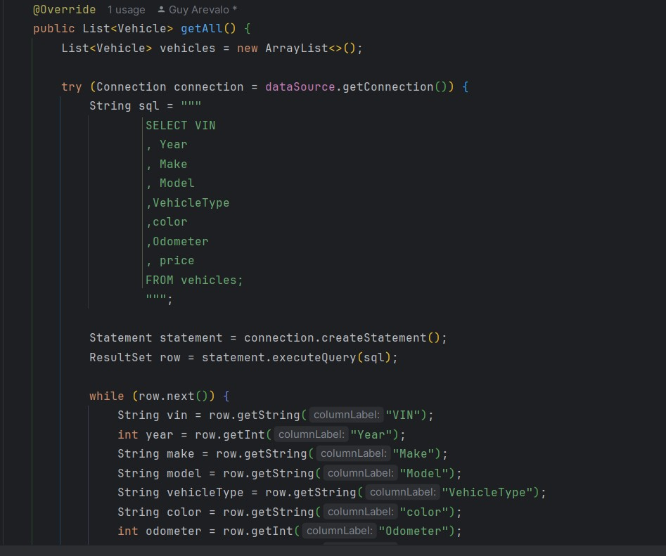

# UpgradedCarDealershipApp
(This is just a place holder from the old version of this application till I edit it)
A workshop to make a console-based dealership application with straightforward features. It has one Screen(UserInterface class) with 10  options: Find vehicles within a price range(work in progress), Find vehicles by make/model(work in progress),Find vehicles by year range(work in progress), Find vehicles by color(work in progress), Find vehicles by mileage range(work in progress), Find vehicles by type(work in progress), List all vehicles,Add a vehicle(works ,but not as it's meant to), remove a vehicle(work in progress) and exit.

6-14-24
I spent most of the day trying to move over code and getting the main screen to function again while setting it up to use a database. I was able to at least get it to run and setup what classes I think I would need. I still need to redo the database that it's linked to. Some of the data required in the application isn't in the database so that'll have to be reworked still. In the meantime it can run and has a few of it's options running again although it won't lead to anything quite yet.
Picture below are of the classes made today (1st screenshot) and The home screen(HomeView) the user would see.

bugs and issues: N/A

6-15-24

Today I have added the getall(), searchByModel() and searchByColor() to MySqlVehicleDao and adding them to VehicleController. I had to update some of the MySql scripts that I used for the database this application uses. Along with editing the vehicle class so that it worked with the database and the new classes. Right now the only ones written are the search by color,type, model and show all cars.

bugs or issues: N/A 

